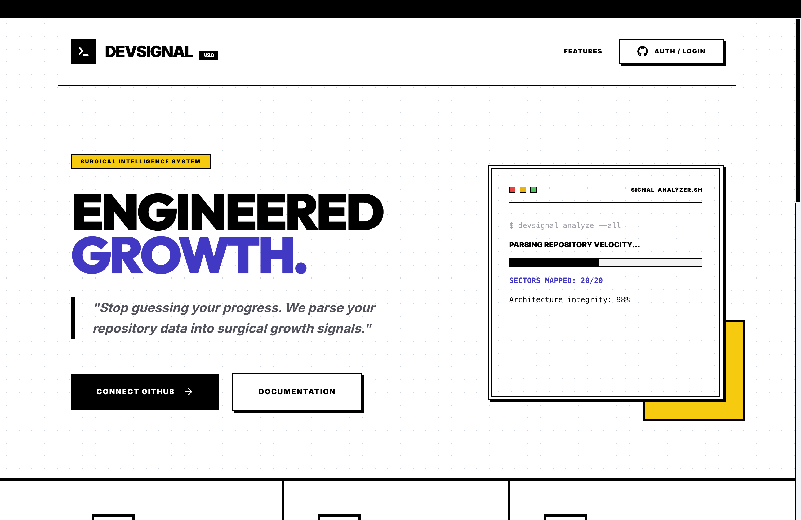

# DevSignal

> **A GitHub-native developer intelligence layer that turns activity into actionable growth.**



---

## Problem Statement

Developers today operate across fragmented tools:

* Code: GitHub
* Learning: YouTube / Docs
* Notes: Notion
* Tracking: Nowhere

Result:

* No visibility into progress
* No structured growth
* High context switching

---

## Proposed Solution

DevSignal connects directly to GitHub and transforms raw activity into:

* Structured analytics
* Growth signals
* Actionable next steps
* Organized learning resources

---

## Core Philosophy

```text
Code -> Signals -> Insights -> Actions -> Growth
```

This is **not**:

* A code hosting platform
* A full IDE
* A social network

This is:

> **A developer growth engine built on real work.**

---

# Architecture Overview

```text
                ┌──────────────────────┐
                │      Frontend        │
                │  React + Vite + TS   │
                └─────────┬────────────┘
                          │
                          ▼
                ┌──────────────────────┐
                │     Backend API      │
                │ Hono on Cloudflare   │
                │       Workers        │
                └─────────┬────────────┘
                          │
        ┌─────────────────┼─────────────────┐
        ▼                 ▼                 ▼
┌──────────────┐  ┌──────────────┐  ┌──────────────┐
│  GitHub API  │  │  Supabase DB │  │  In-memory   │
│  (Octokit)   │  │  (Postgres)  │  │ Worker cache │
└──────────────┘  └──────────────┘  └──────────────┘
```

---

# Authentication Flow

Uses **Supabase GitHub OAuth**

```text
User clicks "Login with GitHub"
        ↓
Redirect to GitHub OAuth
        ↓
User grants permission
        ↓
Supabase receives auth code
        ↓
Supabase exchanges for access token
        ↓
Session created
        ↓
Frontend gets GitHub access token
```

---

# Data Flow (Critical Backbone)

```text
Frontend
   ↓
Backend (/sync)
   ↓
GitHub API (Octokit)
   ↓
Process + Aggregate Data
   ↓
Store in DB (Supabase)
   ↓
Frontend reads from DB (NOT GitHub)
```

---

# Tech Stack

## Frontend

* React 19 + Vite
* TypeScript (strict)
* Tailwind CSS v4
* React Router v7
* TanStack Query
* Framer Motion, lucide-react
* Monaco Editor (in-browser code editor)
* React Three Fiber / drei (3D landing visuals)

---

## Backend

* Hono
* Cloudflare Workers (Wrangler dev / deploy)
* Octokit (GitHub SDK)
* In-memory per-isolate cache (`server/src/utils/cache.ts`)

---

## Database

* Supabase (PostgreSQL)

---

## Authentication

* Supabase GitHub OAuth

---

# Core Features (v1)

## 1. Analytics Dashboard

* Repository overview
* Language breakdown
* Contribution insights
* Activity summary

---

## 2. Resource Library

* Save learning resources
* Tagging and filtering
* Personal ratings

---

## 3. Lightweight Code Editor

* Monaco-based editor
* Code execution (basic functionality)
* Snippet saving

---

# GitHub Data Synchronization

### Initial Synchronization

```text
User logs in
   ↓
Backend fetches:
   - Repositories
   - Languages
   - Contributions
   ↓
Stores in Database
```

---

### Incremental Synchronization

```text
User revisits dashboard
   ↓
Check cache freshness
   ↓
Refresh in background if stale
```

---


# Data Model (Simplified)

```text
User
 ├── githubId
 ├── username
 ├── skillLevel
 └── createdAt

Repo
 ├── name
 ├── stars
 ├── forks
 ├── language
 └── lastUpdated

Analytics
 ├── contributionData
 ├── languageStats
 └── streaks

Resource
 ├── title
 ├── url
 ├── tags
 └── rating
```

---

# Caching Strategy

| Data          | Strategy        |
| ------------- | --------------- |
| Repositories  | Cache 10–30 min |
| Languages     | Cache per repo  |
| Contributions | Refresh daily   |

---

### Logic

```text
If cache exists and is fresh:
    return cached data
Else:
    fetch from GitHub
    store in database
    return data
```

---

# User Flow

## 1. Landing Page (`/`)

* Product explanation
* Login with GitHub

---

## 2. Authentication

* GitHub OAuth via Supabase

---

## 3. Initial Synchronization

```text
"Synchronizing your GitHub data..."
```

---

## 4. Dashboard

* Repository list
* Statistics
* Activity overview

---

## 5. Repository Detail

```text
/dashboard -> /repo/:id
```

* Languages
* Contributors
* Issues

---

## 6. Resource Library

* Add, filter, and search resources

---

## 7. Code Editor

* Writing, running, and saving code

---

# Project Structure

```text
devsignal/
├── src/
│   ├── components/   # UI components
│   ├── contexts/     # Auth context (Supabase GitHub OAuth)
│   ├── hooks/        # React Query hooks
│   ├── lib/          # API client, supabase client, utils, sandboxed execution
│   ├── pages/        # Route pages
│   └── test/         # Vitest tests
├── server/
│   └── src/
│       ├── routes/   # Hono API routes (sync, repos, analytics, profile, activity, resources, snippets)
│       ├── utils/    # cache.ts (in-memory Worker cache)
│       ├── env.ts    # Zod-validated environment (Node dev only)
│       ├── server.ts # Hono app entry with CORS + Supabase auth middleware
│       └── types.d.ts
├── supabase/
│   └── migrations/   # SQL schema with RLS policies
```

---


# Project Risk Mitigation

| Risk               | Mitigation           |
| ------------------ | -------------------- |
| GitHub rate limits | Aggressive caching   |
| Slow dashboard     | Precompute data      |
| Scope creep        | Strict v1 scope      |
| Token revocation   | Handle 401 and re-auth |

---

# Project Roadmap

## Phase 1 (v1)

* Analytics
* Resources
* Editor
* Learning paths

---

## Phase 2 (v2)

* Organization intelligence
* Webhooks

---

## Phase 3 (v3)

* AI Assistant (context-aware)

---

# Local Setup

### 1. Clone & install

```bash
git clone https://github.com/tarunyaio/DevSignal-IntelligentDeveloperGrowth.git
cd DevSignal-IntelligentDeveloperGrowth
npm install
cd server && npm install && cd ..
```

### 2. Configure environment

DevSignal requires real Supabase credentials and a running backend — there is **no guest / mock mode**. The frontend will throw on boot if Supabase env vars are missing.

Create `.env.local` in the project root:

```bash
# Frontend (Vite)
VITE_SUPABASE_URL=https://<project-ref>.supabase.co
VITE_SUPABASE_ANON_KEY=<anon-key>
VITE_API_URL=http://localhost:3001
```

Create `server/.dev.vars` (used by Wrangler in dev) — or `server/.env` if you run with Node tooling:

```bash
# Backend (Hono on Cloudflare Workers)
SUPABASE_URL=https://<project-ref>.supabase.co
SUPABASE_SERVICE_ROLE_KEY=<service-role-key>
GITHUB_TOKEN=<github-personal-access-token>   # optional, used as a fallback when a user lacks a provider token
```

> The GitHub OAuth flow itself is handled by Supabase, so no `GITHUB_CLIENT_ID` / `GITHUB_CLIENT_SECRET` are needed in this repo — configure those in your Supabase project's Auth → Providers → GitHub settings.

Apply the database schema from `supabase/migrations/001_initial_schema.sql` to your Supabase project (SQL editor or `supabase db push`).

### 3. Start backend

```bash
cd server
npm run dev      # runs `wrangler dev` on port 3001
```

### 4. Start frontend

```bash
npm run dev
```

The app is served at `http://localhost:5173` and calls the API at `http://localhost:3001` (override with `VITE_API_URL`).

---

# Testing

```bash
npm run test        # vitest (unit + sanity)
npm run lint        # eslint
npm run build       # type-check + production build
```
